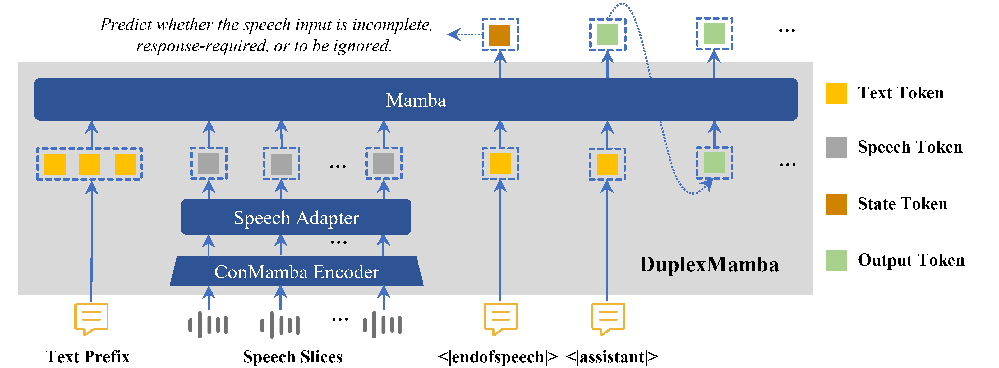
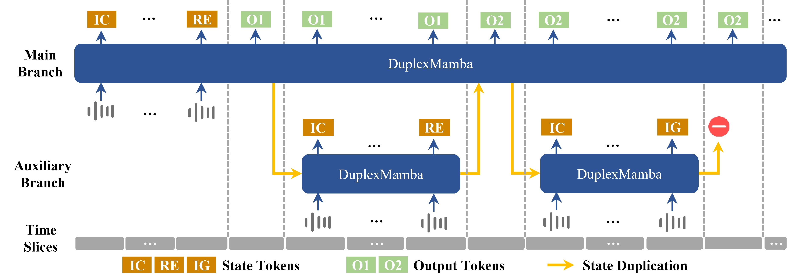
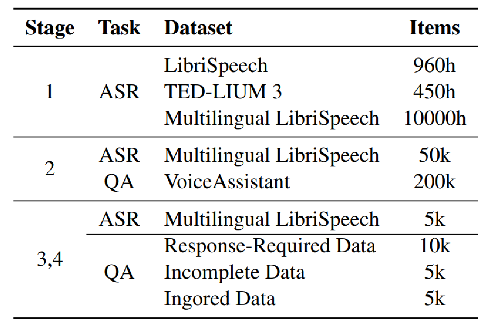
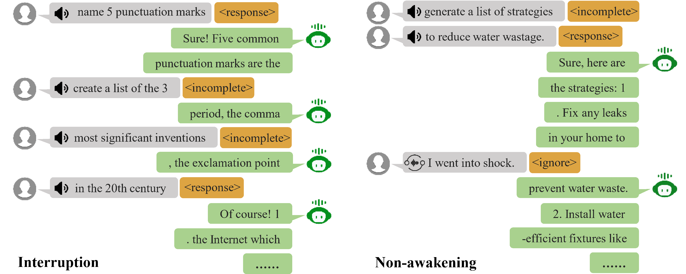

# DuplexMamba [](https://arxiv.org/abs/2502.11123)

## Architecture




## Prerequisites

#### Install Packages

```
conda create --name DuplexMamba python=3.9
conda activate DuplexMamba
pip install -r requirements.txt
pip install -e src/transformers/
pip install -e src/speechbrain/
```
You may need to install lower or higher versions of torch, torchaudio, causal-conv1d and mamba-ssm based on your hardware and system. Make sure they are compatible. If the installation of `causal-conv1d` and `mamba-ssm` fails, you can manually download the corresponding `.whl` files from [causal-conv1d releases](https://github.com/Dao-AILab/causal-conv1d/releases) and [mamba releases](https://github.com/state-spaces/mamba/releases/) and install them.

#### Pretrained Model and Checkpoints

1. Download the [mamba-2.8b-hf](https://huggingface.co/state-spaces/mamba-2.8b-hf) into the `model` folder, then run:

   ```
   python safetensor2bin.py
   ```

2. Download the checkpoint of our trained ASR model and the checkpoints for all four stages of the DuplexMamba model from [DuplexMamba](https://huggingface.co/Xiangyu1/DuplexMamba/tree/main) and save them in the `checkpoints` folder. If you only need the model for inference, you can simply download the Stage 4 checkpoint.


## Training


#### datasets 

1. Our training code requires all data to be stored in a format similar to LibriSpeech.
2. For the raw data of Stage 1 and Stage 2, you can download [LibriSpeech](https://www.openslr.org/12), [TED-LIUM](https://huggingface.co/datasets/LIUM/tedlium), [mls_eng_10k](https://huggingface.co/datasets/parler-tts/mls_eng_10k), and [ VoiceAssistant-400K](https://huggingface.co/datasets/gpt-omni/VoiceAssistant-400K).
3. The state discrimination dataset we used can be accessed [here](https://huggingface.co/datasets/Xiangyu1/DuplexMamba-state_discrimination).
4. For the preprocessed data for Stage 3 and Stage 4, you can download it from [here](https://huggingface.co/datasets/Xiangyu1/duplexmamba_preprocessed_training_data/tree/main).

**Stage1** Multimodal Alignment:

```
torchrun --nproc-per-node 6 train_stage1.py hparams/S2S/train_stage1.yaml --data_folder <YOUR_PATH_TO_DATASETS> --precision bf16
```
**Stage2** Multimodal Instruction Tuning:

```
torchrun --nproc-per-node 6 train_stage2.py hparams/S2S/train_stage2.yaml --data_folder <YOUR_PATH_TO_DATASETS> --precision bf16
```
**Stage3** Input State Discrimination:

```
torchrun --nproc-per-node 6 train_stage3.py hparams/S2S/train_stage3.yaml --data_folder <YOUR_PATH_TO_DATASETS> --precision bf16
```

**Stage4** Streaming Alignment:

```
torchrun --nproc-per-node 1 train_stage4.py hparams/S2S/train_stage4.yaml --data_folder <YOUR_PATH_TO_DATASETS> --precision bf16
```

## Inference

```
python CustomGenerator.py duplex/duplex.yaml --precision bf16 --wav_path example/rlhf-57762.flac
```

We also provide the `duplex_voice_assistant()` method in the `duplex_inference.py` script for simulating duplex conversations. You can modify `wav_list` on line 236 and `output_dir` on line 239 of the script, then run the following command to start the experiment:

```
python duplex_inference.py duplex/duplex.yaml --precision bf16
```

## A simple Case 



## Acknowledgement

We acknowledge the wonderful work of [Mamba](https://arxiv.org/abs/2312.00752), [Vision Mamba](https://arxiv.org/abs/2401.09417), and [ConMamba](https://arxiv.org/abs/2407.09732). We borrowed their implementation of [Mamba](https://github.com/state-spaces/mamba),  [bidirectional Mamba](https://github.com/hustvl/Vim), and [ConMamba](https://github.com/xi-j/Mamba-ASR). The training recipes are adapted from [SpeechBrain](https://speechbrain.github.io).

## Citation
If you find this work helpful, please consider citing:

```bibtex
@misc{lu2025duplexmambaenhancingrealtimespeech,
      title={DuplexMamba: Enhancing Real-time Speech Conversations with Duplex and Streaming Capabilities}, 
      author={Xiangyu Lu and Wang Xu and Haoyu Wang and Hongyun Zhou and Haiyan Zhao and Conghui Zhu and Tiejun Zhao and Muyun Yang},
      year={2025},
      eprint={2502.11123},
      archivePrefix={arXiv},
      primaryClass={cs.CL},
      url={https://arxiv.org/abs/2502.11123}, 
}
```

## License 

This project is licensed under the [GNU General Public License v3.0](LICENSE). It is based on **[Mamba-ASR](https://github.com/xi-j/Mamba-ASR)**, which is also licensed under the GPL.
